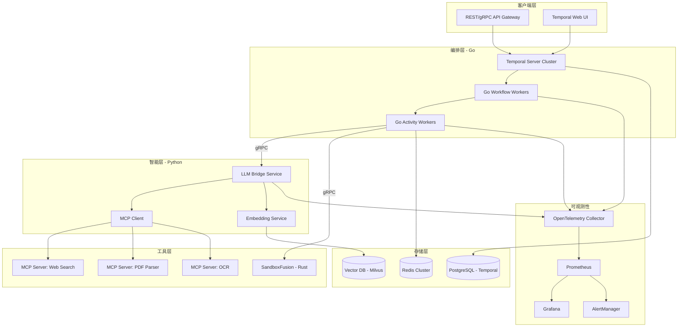
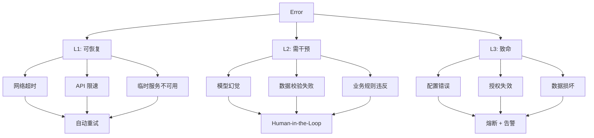
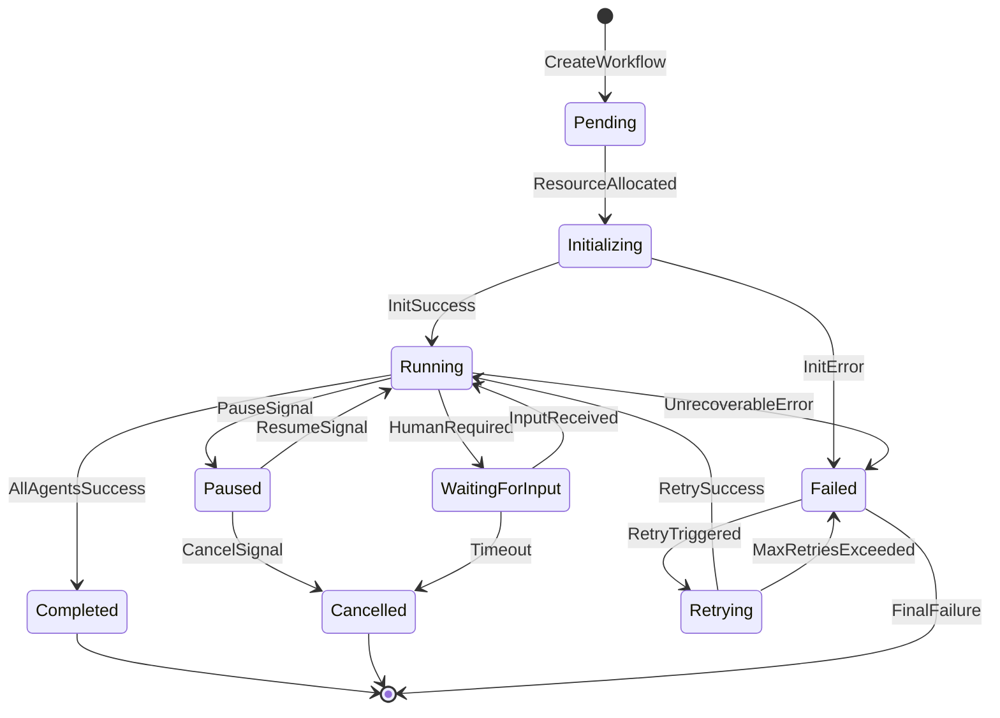

# 启动本地环境
make dev-up

# 构建
make build

# 运行
make run-worker  # 终端1
make run-llm-bridge  # 终端2

# BioValue-AI 工业级智能体编排框架规范

> 版本: 2.0 | 状态: Production-Ready | 最后更新: 2026-01

---

## 1. 系统架构总览

### 1.1 核心设计目标

构建一个具备以下特性的 Agent 集群：

| 特性 | 描述 | 实现方式 |
|------|------|----------|
| **强一致性** | 工作流状态可靠持久化 | Temporal Event Sourcing |
| **故障恢复** | 任意节点失败自动恢复 | Saga + Compensation |
| **多模态工具调用** | 动态发现与调用外部能力 | MCP (Model Context Protocol) |
| **水平扩展** | 无状态 Worker 弹性伸缩 | K8s HPA + Temporal Task Queue |

### 1.2 系统拓扑图



### 1.3 数据流与控制流

```mermaid
sequenceDiagram
    participant C as Client
    participant T as Temporal
    participant W as Go Worker
    participant L as LLM Bridge
    participant M as MCP Tools
    participant R as Redis
    participant V as VectorDB

    C->>T: StartWorkflow(company_ticker)
    T->>W: ScheduleActivity(Agent1)
    
    rect rgb(40, 44, 52)
        Note over W,V: ReAct+ 循环
        W->>R: CheckCache(key)
        alt Cache Hit
            R-->>W: cached_result
        else Cache Miss
            W->>V: SemanticSearch(query)
            V-->>W: context_chunks
            W->>L: Reason(prompt + context)
            L->>L: Generate CoT
            L->>M: Act(tool_call)
            M-->>L: observation
            L-->>W: structured_result
            W->>R: SetCache(key, result, TTL)
            W->>V: UpsertEmbedding(result)
        end
    end
    
    W-->>T: ActivityResult
    T->>W: ScheduleActivity(Agent2)
    Note over T,W: ... 继续执行后续 Agent ...
    T-->>C: WorkflowResult
```



---

## 2. 核心组件规范

### 2.1 Go Orchestrator (Temporal)

#### 2.1.1 Workflow 与 Activity 职责边界

| 组件 | 职责 | 禁止操作 |
|------|------|----------|
| **Workflow** | 状态管理、流程控制、条件分支 | I/O、网络调用、随机数 |
| **Activity** | 外部交互、LLM 调用、数据存取 | 长时间阻塞（需 Heartbeat） |

#### 2.1.2 Workflow 模式定义

```go
// workflow/biovalue.go
func BioValueWorkflow(ctx workflow.Context, input WorkflowInput) (*WorkflowOutput, error) {
    // 1. 配置 Activity 选项
    activityOpts := workflow.ActivityOptions{
        StartToCloseTimeout: 10 * time.Minute,
        HeartbeatTimeout:    30 * time.Second,
        RetryPolicy: &temporal.RetryPolicy{
            InitialInterval:        5 * time.Second,
            BackoffCoefficient:     2.0,
            MaximumInterval:        1 * time.Minute,
            MaximumAttempts:        5,
            NonRetryableErrorTypes: []string{"FatalError", "ValidationError"},
        },
    }
    ctx = workflow.WithActivityOptions(ctx, activityOpts)

    // 2. 并行执行独立 Agent (Fan-out)
    var financialResult, pipelineResult interface{}
    
    financialFuture := workflow.ExecuteActivity(ctx, FinancialAuditorActivity, input)
    pipelineFuture := workflow.ExecuteActivity(ctx, PipelineScoutActivity, input)
    
    // 使用 Selector 等待任意完成或信号
    selector := workflow.NewSelector(ctx)
    
    selector.AddFuture(financialFuture, func(f workflow.Future) {
        f.Get(ctx, &financialResult)
    })
    
    selector.AddFuture(pipelineFuture, func(f workflow.Future) {
        f.Get(ctx, &pipelineResult)
    })
    
    // 监听人工干预信号
    var interventionSignal InterventionSignal
    signalChan := workflow.GetSignalChannel(ctx, "human-intervention")
    selector.AddReceive(signalChan, func(c workflow.ReceiveChannel, more bool) {
        c.Receive(ctx, &interventionSignal)
        // 处理人工干预逻辑
    })
    
    for i := 0; i < 2; i++ {
        selector.Select(ctx)
    }

    // 3. 串行执行依赖 Agent (Fan-in)
    var clinicalResult interface{}
    if err := workflow.ExecuteActivity(ctx, ClinicalAssessorActivity, 
        pipelineResult).Get(ctx, &clinicalResult); err != nil {
        return nil, handleActivityError(err)
    }

    // 4. Child Workflow 处理复杂子流程
    childOpts := workflow.ChildWorkflowOptions{
        WorkflowID: fmt.Sprintf("valuation-%s", input.Ticker),
    }
    childCtx := workflow.WithChildOptions(ctx, childOpts)
    
    var valuationResult interface{}
    if err := workflow.ExecuteChildWorkflow(childCtx, ValuationWorkflow,
        financialResult, clinicalResult).Get(ctx, &valuationResult); err != nil {
        // 触发 Saga 补偿
        return nil, triggerCompensation(ctx, err)
    }

    return &WorkflowOutput{
        Valuation: valuationResult,
        TraceID:   workflow.GetInfo(ctx).WorkflowExecution.RunID,
    }, nil
}
```

#### 2.1.3 Saga 补偿模式

```go
// workflow/saga.go
type SagaCompensation struct {
    steps []CompensationStep
}

func (s *SagaCompensation) AddCompensation(name string, fn func(ctx workflow.Context) error) {
    s.steps = append([]CompensationStep{{Name: name, Fn: fn}}, s.steps...)
}

func (s *SagaCompensation) Execute(ctx workflow.Context) error {
    for _, step := range s.steps {
        if err := step.Fn(ctx); err != nil {
            workflow.GetLogger(ctx).Error("Compensation failed", 
                "step", step.Name, "error", err)
            // 记录补偿失败，人工介入
            workflow.ExecuteActivity(ctx, NotifyCompensationFailure, step.Name)
        }
    }
    return nil
}
```

#### 2.1.4 Signal 与 Query 使用场景

| 机制 | 用途 | 示例 |
|------|------|------|
| **Signal** | 外部事件注入（异步） | 人工审批、紧急停止、参数更新 |
| **Query** | 状态查询（同步、只读） | 进度查询、当前估值预览 |

```go
// Query Handler 注册
workflow.SetQueryHandler(ctx, "progress", func() (ProgressInfo, error) {
    return ProgressInfo{
        CurrentAgent: currentAgent,
        Completed:    completedSteps,
        Total:        totalSteps,
    }, nil
})

// Signal Handler 注册
workflow.Go(ctx, func(gCtx workflow.Context) {
    for {
        selector.AddReceive(pauseChan, func(c workflow.ReceiveChannel, _ bool) {
            c.Receive(gCtx, nil)
            workflow.Await(gCtx, func() bool { return !isPaused })
        })
        selector.Select(gCtx)
    }
})
```

### 2.2 Python LLM Bridge (gRPC Service)

#### 2.2.1 服务接口定义

```protobuf
// proto/llm_bridge.proto
syntax = "proto3";
package biovalue.llm;

service LLMBridge {
    // 单次推理
    rpc Infer(InferRequest) returns (InferResponse);
    
    // 流式推理
    rpc InferStream(InferRequest) returns (stream InferChunk);
    
    // 批量推理
    rpc InferBatch(InferBatchRequest) returns (InferBatchResponse);
    
    // 健康检查
    rpc HealthCheck(Empty) returns (HealthStatus);
}

message InferRequest {
    string trace_id = 1;
    string agent_id = 2;
    string system_prompt = 3;
    string user_prompt = 4;
    repeated string image_paths = 5;
    repeated ContextChunk context = 6;
    InferConfig config = 7;
}

message InferConfig {
    float temperature = 1;
    int32 max_tokens = 2;
    repeated string stop_sequences = 3;
    bool enable_tools = 4;
    repeated ToolDefinition tools = 5;
}

message InferResponse {
    string trace_id = 1;
    ResponseStatus status = 2;
    ThoughtChain thought = 3;
    ToolCall tool_call = 4;
    string final_answer = 5;
    UsageMetrics usage = 6;
}

message ThoughtChain {
    string reasoning = 1;
    string plan = 2;
    float confidence = 3;
}

message ToolCall {
    string tool_name = 1;
    string tool_input = 2;  // JSON string
    string mcp_server = 3;
}

enum ResponseStatus {
    SUCCESS = 0;
    TOOL_REQUIRED = 1;
    VALIDATION_FAILED = 2;
    RATE_LIMITED = 3;
    ERROR = 4;
}
```

#### 2.2.2 MCP 客户端集成

```python
# llm_bridge/mcp_client.py
from mcp import ClientSession, StdioServerParameters
from mcp.client.stdio import stdio_client
import asyncio
from typing import Dict, Any, List
import json

class MCPClientManager:
    """MCP 客户端管理器 - 动态发现与连接"""
    
    def __init__(self, config: Dict[str, Any]):
        self.servers: Dict[str, ClientSession] = {}
        self.config = config
        self._lock = asyncio.Lock()
    
    async def discover_and_connect(self) -> None:
        """服务发现与连接"""
        for server_config in self.config.get("mcp_servers", []):
            server_id = server_config["id"]
            try:
                session = await self._connect_server(server_config)
                self.servers[server_id] = session
                # 列出可用工具
                tools = await session.list_tools()
                logger.info(f"Connected to {server_id}, tools: {[t.name for t in tools]}")
            except Exception as e:
                logger.error(f"Failed to connect {server_id}: {e}")
                # 标记为不可用，后续重试
                self.servers[server_id] = None
    
    async def call_tool(
        self, 
        server_id: str, 
        tool_name: str, 
        arguments: Dict[str, Any],
        timeout: float = 30.0
    ) -> Dict[str, Any]:
        """调用 MCP 工具"""
        async with self._lock:
            session = self.servers.get(server_id)
            if session is None:
                raise MCPServerUnavailable(server_id)
        
        try:
            result = await asyncio.wait_for(
                session.call_tool(tool_name, arguments),
                timeout=timeout
            )
            return {
                "status": "success",
                "data": result.content,
                "tool": tool_name,
                "server": server_id
            }
        except asyncio.TimeoutError:
            raise MCPToolTimeout(tool_name, timeout)
        except Exception as e:
            raise MCPToolError(tool_name, str(e))
    
    async def health_check(self) -> Dict[str, bool]:
        """健康检查所有服务器"""
        results = {}
        for server_id, session in self.servers.items():
            try:
                if session:
                    await session.ping()
                    results[server_id] = True
                else:
                    results[server_id] = False
            except:
                results[server_id] = False
        return results
```

#### 2.2.3 Token 限速与熔断

```python
# llm_bridge/rate_limiter.py
import asyncio
from dataclasses import dataclass
from datetime import datetime, timedelta
from enum import Enum

class CircuitState(Enum):
    CLOSED = "closed"      # 正常
    OPEN = "open"          # 熔断
    HALF_OPEN = "half_open"  # 探测

@dataclass
class RateLimitConfig:
    requests_per_minute: int = 60
    tokens_per_minute: int = 100000
    burst_multiplier: float = 1.5
    circuit_failure_threshold: int = 5
    circuit_recovery_timeout: int = 60

class AdaptiveRateLimiter:
    """自适应限速器 + 熔断器"""
    
    def __init__(self, config: RateLimitConfig):
        self.config = config
        self.request_tokens = asyncio.Semaphore(
            int(config.requests_per_minute * config.burst_multiplier)
        )
        self.token_bucket = config.tokens_per_minute
        self.consecutive_failures = 0
        self.circuit_state = CircuitState.CLOSED
        self.last_failure_time: datetime = None
        self._lock = asyncio.Lock()
    
    async def acquire(self, estimated_tokens: int) -> bool:
        """获取执行许可"""
        async with self._lock:
            # 检查熔断状态
            if self.circuit_state == CircuitState.OPEN:
                if self._should_try_recovery():
                    self.circuit_state = CircuitState.HALF_OPEN
                else:
                    raise CircuitBreakerOpen("LLM service circuit is open")
            
            # 检查 Token 配额
            if self.token_bucket < estimated_tokens:
                raise TokenQuotaExceeded(estimated_tokens, self.token_bucket)
            
            self.token_bucket -= estimated_tokens
            return True
    
    async def record_success(self, actual_tokens: int) -> None:
        """记录成功调用"""
        async with self._lock:
            self.consecutive_failures = 0
            if self.circuit_state == CircuitState.HALF_OPEN:
                self.circuit_state = CircuitState.CLOSED
            # 调整实际消耗
            token_diff = actual_tokens - self._last_estimated
            if token_diff > 0:
                self.token_bucket -= token_diff
    
    async def record_failure(self, error: Exception) -> None:
        """记录失败调用"""
        async with self._lock:
            self.consecutive_failures += 1
            self.last_failure_time = datetime.utcnow()
            
            if self.consecutive_failures >= self.config.circuit_failure_threshold:
                self.circuit_state = CircuitState.OPEN
                logger.warning(f"Circuit breaker OPEN after {self.consecutive_failures} failures")
    
    def _should_try_recovery(self) -> bool:
        if self.last_failure_time is None:
            return True
        elapsed = (datetime.utcnow() - self.last_failure_time).seconds
        return elapsed >= self.config.circuit_recovery_timeout
```

---

## 3. 安全性规范

### 3.1 密钥管理

#### 3.1.1 分层策略

```yaml
# config/secrets-policy.yaml
environments:
  development:
    source: ".env.local"
    encryption: none
    rotation: manual
    
  staging:
    source: "kubernetes-secret"
    encryption: base64
    rotation: weekly
    
  production:
    source: "hashicorp-vault"
    encryption: transit
    rotation: daily
    audit: enabled
```

#### 3.1.2 Vault 集成

```go
// pkg/secrets/vault.go
type VaultClient struct {
    client *vault.Client
    config *VaultConfig
}

func (v *VaultClient) GetLLMAPIKey(ctx context.Context) (string, error) {
    secret, err := v.client.KVv2(v.config.MountPath).Get(ctx, "llm/api-keys")
    if err != nil {
        return "", fmt.Errorf("vault read failed: %w", err)
    }
    
    key, ok := secret.Data["openai_key"].(string)
    if !ok {
        return "", ErrSecretNotFound
    }
    
    // 记录访问审计
    v.auditLog(ctx, "llm/api-keys", "read")
    return key, nil
}

func (v *VaultClient) RotateKey(ctx context.Context, keyPath string) error {
    // 生成新密钥
    newKey, err := v.generateKey()
    if err != nil {
        return err
    }
    
    // 原子更新
    _, err = v.client.KVv2(v.config.MountPath).Put(ctx, keyPath, map[string]interface{}{
        "key":        newKey,
        "rotated_at": time.Now().UTC().Format(time.RFC3339),
        "version":    v.incrementVersion(keyPath),
    })
    
    return err
}
```

### 3.2 数据加密

| 场景 | 加密方式 | 密钥管理 |
|------|----------|----------|
| **传输层** | TLS 1.3 (mTLS for internal) | Cert-Manager 自动轮换 |
| **Redis 存储** | AES-256-GCM | Vault Transit Engine |
| **Vector DB** | 客户端加密 | 应用层密钥 |
| **日志脱敏** | SHA-256 哈希 | 不可逆 |

```go
// pkg/crypto/encrypt.go
type DataEncryptor struct {
    transitClient *vault.Transit
}

func (e *DataEncryptor) EncryptForRedis(ctx context.Context, plaintext []byte) ([]byte, error) {
    ciphertext, err := e.transitClient.Encrypt(ctx, "redis-key", plaintext)
    if err != nil {
        return nil, fmt.Errorf("transit encrypt failed: %w", err)
    }
    return ciphertext, nil
}

func (e *DataEncryptor) DecryptFromRedis(ctx context.Context, ciphertext []byte) ([]byte, error) {
    plaintext, err := e.transitClient.Decrypt(ctx, "redis-key", ciphertext)
    if err != nil {
        return nil, fmt.Errorf("transit decrypt failed: %w", err)
    }
    return plaintext, nil
}
```

### 3.3 访问控制 (RBAC)

```yaml
# config/rbac.yaml
roles:
  - name: workflow-executor
    permissions:
      - resource: "workflow/*"
        actions: ["start", "signal", "query"]
      - resource: "activity/*"
        actions: ["execute"]
      - resource: "redis/cache/*"
        actions: ["read", "write"]
        
  - name: analyst
    permissions:
      - resource: "workflow/*"
        actions: ["query"]
      - resource: "report/*"
        actions: ["read"]
        
  - name: admin
    permissions:
      - resource: "*"
        actions: ["*"]

bindings:
  - role: workflow-executor
    subjects:
      - kind: ServiceAccount
        name: go-worker
        namespace: biovalue
        
  - role: analyst
    subjects:
      - kind: Group
        name: analysts
        provider: oidc
```

### 3.4 审计日志

```go
// pkg/audit/logger.go
type AuditEvent struct {
    Timestamp   time.Time              `json:"timestamp"`
    TraceID     string                 `json:"trace_id"`
    Actor       Actor                  `json:"actor"`
    Action      string                 `json:"action"`
    Resource    string                 `json:"resource"`
    Outcome     string                 `json:"outcome"`
    Metadata    map[string]interface{} `json:"metadata"`
    SourceIP    string                 `json:"source_ip"`
    UserAgent   string                 `json:"user_agent"`
}

type AuditLogger struct {
    writer io.Writer  // 写入不可变存储 (S3/GCS with Object Lock)
}

func (a *AuditLogger) Log(ctx context.Context, event AuditEvent) error {
    event.Timestamp = time.Now().UTC()
    event.TraceID = trace.SpanContextFromContext(ctx).TraceID().String()
    
    data, err := json.Marshal(event)
    if err != nil {
        return err
    }
    
    // 追加写入，不可修改
    _, err = a.writer.Write(append(data, '\n'))
    return err
}

// 审计的关键操作
var AuditableActions = []string{
    "workflow.start",
    "workflow.terminate",
    "secret.read",
    "secret.rotate",
    "llm.infer",
    "tool.execute",
    "data.export",
}
```

---

## 4. 错误处理分级

### 4.1 错误分类体系



### 4.2 错误处理实现

```go
// pkg/errors/classify.go
type ErrorLevel int

const (
    L1Recoverable ErrorLevel = iota + 1
    L2Intervention
    L3Fatal
)

type ClassifiedError struct {
    Level       ErrorLevel
    Code        string
    Message     string
    Cause       error
    Retryable   bool
    MaxRetries  int
    Metadata    map[string]interface{}
}

func ClassifyError(err error) *ClassifiedError {
    switch {
    case errors.Is(err, context.DeadlineExceeded):
        return &ClassifiedError{
            Level:      L1Recoverable,
            Code:       "TIMEOUT",
            Retryable:  true,
            MaxRetries: 3,
        }
    case errors.Is(err, ErrRateLimited):
        return &ClassifiedError{
            Level:      L1Recoverable,
            Code:       "RATE_LIMITED",
            Retryable:  true,
            MaxRetries: 5,
            Metadata:   map[string]interface{}{"backoff": "exponential"},
        }
    case errors.Is(err, ErrValidationFailed):
        return &ClassifiedError{
            Level:     L2Intervention,
            Code:      "VALIDATION_FAILED",
            Retryable: false,
        }
    case errors.Is(err, ErrHallucination):
        return &ClassifiedError{
            Level:     L2Intervention,
            Code:      "LLM_HALLUCINATION",
            Retryable: true,
            MaxRetries: 2,  // 允许有限重试
            Metadata:   map[string]interface{}{"require_human_review": true},
        }
    case errors.Is(err, ErrConfigInvalid), errors.Is(err, ErrAuthFailed):
        return &ClassifiedError{
            Level:     L3Fatal,
            Code:      "FATAL_CONFIG",
            Retryable: false,
        }
    default:
        return &ClassifiedError{
            Level:      L1Recoverable,
            Code:       "UNKNOWN",
            Retryable:  true,
            MaxRetries: 1,
        }
    }
}
```

### 4.3 Dead Letter Queue (DLQ)

```go
// pkg/dlq/handler.go
type DLQMessage struct {
    WorkflowID    string                 `json:"workflow_id"`
    ActivityName  string                 `json:"activity_name"`
    Error         *ClassifiedError       `json:"error"`
    Input         json.RawMessage        `json:"input"`
    Attempts      int                    `json:"attempts"`
    FirstFailedAt time.Time              `json:"first_failed_at"`
    LastFailedAt  time.Time              `json:"last_failed_at"`
    TraceContext  map[string]string      `json:"trace_context"`
}

type DLQHandler struct {
    redisClient *redis.Client
    notifier    Notifier
}

func (h *DLQHandler) Enqueue(ctx context.Context, msg *DLQMessage) error {
    msg.LastFailedAt = time.Now().UTC()
    if msg.FirstFailedAt.IsZero() {
        msg.FirstFailedAt = msg.LastFailedAt
    }
    
    data, _ := json.Marshal(msg)
    
    // 写入 Redis Stream
    err := h.redisClient.XAdd(ctx, &redis.XAddArgs{
        Stream: "biovalue:dlq",
        Values: map[string]interface{}{
            "data": data,
        },
    }).Err()
    
    if err != nil {
        return err
    }
    
    // 根据错误级别触发通知
    if msg.Error.Level >= L2Intervention {
        h.notifier.Send(ctx, NotificationEvent{
            Type:     "dlq_message",
            Severity: msg.Error.Level.String(),
            Title:    fmt.Sprintf("DLQ: %s - %s", msg.ActivityName, msg.Error.Code),
            Details:  msg,
        })
    }
    
    return nil
}

// DLQ 消费者 - 人工处理界面后端
func (h *DLQHandler) ProcessWithIntervention(ctx context.Context, msgID string, action InterventionAction) error {
    switch action.Type {
    case "retry":
        return h.retryMessage(ctx, msgID, action.ModifiedInput)
    case "skip":
        return h.markSkipped(ctx, msgID, action.Reason)
    case "escalate":
        return h.escalate(ctx, msgID, action.AssignTo)
    default:
        return ErrUnknownAction
    }
}
```

---

## 5. 可观测性规范

### 5.1 Metrics (SLI/SLO)

```yaml
# monitoring/sli-slo.yaml
slis:
  - name: workflow_success_rate
    description: "工作流成功完成率"
    query: |
      sum(rate(workflow_completed_total{status="success"}[5m])) /
      sum(rate(workflow_completed_total[5m]))
    
  - name: llm_latency_p99
    description: "LLM 推理 P99 延迟"
    query: |
      histogram_quantile(0.99, rate(llm_inference_duration_seconds_bucket[5m]))
    
  - name: token_cost_daily
    description: "每日 Token 消耗成本"
    query: |
      sum(increase(llm_token_usage_total[24h])) * on(model) group_left llm_token_price

slos:
  - name: availability
    target: 99.9%
    window: 30d
    sli: workflow_success_rate
    
  - name: latency
    target: 95%
    threshold: 30s
    window: 7d
    sli: llm_latency_p99
```

#### Prometheus Metrics 定义

```go
// pkg/metrics/prometheus.go
var (
    WorkflowDuration = promauto.NewHistogramVec(
        prometheus.HistogramOpts{
            Name:    "biovalue_workflow_duration_seconds",
            Help:    "Workflow execution duration",
            Buckets: []float64{1, 5, 10, 30, 60, 120, 300, 600},
        },
        []string{"workflow_type", "status"},
    )
    
    ActivityDuration = promauto.NewHistogramVec(
        prometheus.HistogramOpts{
            Name:    "biovalue_activity_duration_seconds",
            Help:    "Activity execution duration",
            Buckets: []float64{0.1, 0.5, 1, 5, 10, 30, 60},
        },
        []string{"activity_name", "agent_id", "status"},
    )
    
    LLMTokenUsage = promauto.NewCounterVec(
        prometheus.CounterOpts{
            Name: "biovalue_llm_token_usage_total",
            Help: "Total LLM tokens consumed",
        },
        []string{"model", "type"}, // type: prompt/completion
    )
    
    CacheHitRate = promauto.NewCounterVec(
        prometheus.CounterOpts{
            Name: "biovalue_cache_operations_total",
            Help: "Cache operations count",
        },
        []string{"operation", "result"}, // result: hit/miss
    )
    
    MCPToolCalls = promauto.NewCounterVec(
        prometheus.CounterOpts{
            Name: "biovalue_mcp_tool_calls_total",
            Help: "MCP tool invocations",
        },
        []string{"server", "tool", "status"},
    )
)
```

### 5.2 Logging (结构化日志)

```go
// pkg/logging/structured.go
type LogEntry struct {
    Timestamp   string                 `json:"timestamp"`
    Level       string                 `json:"level"`
    TraceID     string                 `json:"trace_id"`
    SpanID      string                 `json:"span_id"`
    Service     string                 `json:"service"`
    Component   string                 `json:"component"`
    Message     string                 `json:"message"`
    Error       *ErrorInfo             `json:"error,omitempty"`
    Context     map[string]interface{} `json:"context,omitempty"`
    Duration    *float64               `json:"duration_ms,omitempty"`
}

type ErrorInfo struct {
    Type    string `json:"type"`
    Message string `json:"message"`
    Stack   string `json:"stack,omitempty"`
}

// 日志级别规范
const (
    // DEBUG: 开发调试信息，生产环境默认关闭
    // INFO:  正常业务流程日志
    // WARN:  可恢复的异常情况
    // ERROR: 需要关注的错误
    // FATAL: 服务无法继续运行
)

// 敏感数据脱敏
func SanitizeForLog(data interface{}) interface{} {
    // 递归遍历，对敏感字段进行脱敏
    sensitiveFields := []string{"api_key", "password", "token", "secret"}
    return sanitize(data, sensitiveFields)
}
```

### 5.3 Tracing (OpenTelemetry)

```go
// pkg/tracing/otel.go
func InitTracer(serviceName string) (*sdktrace.TracerProvider, error) {
    exporter, err := otlptracehttp.New(context.Background(),
        otlptracehttp.WithEndpoint(os.Getenv("OTEL_EXPORTER_ENDPOINT")),
        otlptracehttp.WithInsecure(),
    )
    if err != nil {
        return nil, err
    }
    
    tp := sdktrace.NewTracerProvider(
        sdktrace.WithBatcher(exporter),
        sdktrace.WithResource(resource.NewWithAttributes(
            semconv.SchemaURL,
            semconv.ServiceName(serviceName),
            semconv.ServiceVersion(version.Version),
            attribute.String("environment", os.Getenv("ENV")),
        )),
        sdktrace.WithSampler(sdktrace.TraceIDRatioBased(0.1)), // 10% 采样
    )
    
    otel.SetTracerProvider(tp)
    otel.SetTextMapPropagator(propagation.NewCompositeTextMapPropagator(
        propagation.TraceContext{},
        propagation.Baggage{},
    ))
    
    return tp, nil
}

// Span 命名规范
// 格式: {component}.{operation}
// 示例:
//   - workflow.BioValueWorkflow
//   - activity.FinancialAuditor
//   - llm.infer
//   - mcp.call.web_search
//   - redis.get
//   - vectordb.search
```

### 5.4 Alerting 规则

```yaml
# monitoring/alerts.yaml
groups:
  - name: biovalue-critical
    rules:
      - alert: WorkflowSuccessRateLow
        expr: |
          (sum(rate(workflow_completed_total{status="success"}[5m])) /
           sum(rate(workflow_completed_total[5m]))) < 0.95
        for: 5m
        labels:
          severity: critical
        annotations:
          summary: "工作流成功率低于 95%"
          runbook: "https://wiki/runbooks/workflow-failure"
          
      - alert: LLMLatencyHigh
        expr: |
          histogram_quantile(0.99, rate(llm_inference_duration_seconds_bucket[5m])) > 60
        for: 10m
        labels:
          severity: warning
        annotations:
          summary: "LLM P99 延迟超过 60 秒"
          
      - alert: CircuitBreakerOpen
        expr: circuit_breaker_state{state="open"} == 1
        for: 1m
        labels:
          severity: critical
        annotations:
          summary: "熔断器已打开: {{ $labels.service }}"
          
      - alert: DLQBacklogHigh
        expr: redis_stream_length{stream="biovalue:dlq"} > 100
        for: 15m
        labels:
          severity: warning
        annotations:
          summary: "DLQ 积压消息超过 100 条"

  - name: biovalue-cost
    rules:
      - alert: TokenCostAnomaly
        expr: |
          sum(increase(llm_token_usage_total[1h])) > 
          (avg_over_time(sum(increase(llm_token_usage_total[1h]))[7d:1h]) * 2)
        for: 30m
        labels:
          severity: warning
        annotations:
          summary: "Token 消耗异常，超过 7 日平均值 2 倍"
```

---

## 6. Agent 生命周期状态机

### 6.1 状态定义



### 6.2 状态转换实现

```go
// pkg/lifecycle/state_machine.go
type WorkflowState string

const (
    StatePending         WorkflowState = "PENDING"
    StateInitializing    WorkflowState = "INITIALIZING"
    StateRunning         WorkflowState = "RUNNING"
    StatePaused          WorkflowState = "PAUSED"
    StateWaitingForInput WorkflowState = "WAITING_FOR_INPUT"
    StateRetrying        WorkflowState = "RETRYING"
    StateCompleted       WorkflowState = "COMPLETED"
    StateCancelled       WorkflowState = "CANCELLED"
    StateFailed          WorkflowState = "FAILED"
)

type StateTransition struct {
    From      WorkflowState
    To        WorkflowState
    Event     string
    Guard     func(ctx context.Context, data interface{}) bool
    Action    func(ctx workflow.Context, data interface{}) error
}

var ValidTransitions = []StateTransition{
    {
        From:  StatePending,
        To:    StateInitializing,
        Event: "resource_allocated",
        Guard: func(ctx context.Context, data interface{}) bool {
            // 检查资源是否就绪
            return checkResourcesReady(ctx)
        },
    },
    {
        From:  StateRunning,
        To:    StatePaused,
        Event: "pause_signal",
        Action: func(ctx workflow.Context, data interface{}) error {
            // 保存当前进度快照
            return saveProgressSnapshot(ctx)
        },
    },
    {
        From:  StateRunning,
        To:    StateWaitingForInput,
        Event: "human_required",
        Action: func(ctx workflow.Context, data interface{}) error {
            // 发送人工干预请求
            return sendHumanInterventionRequest(ctx, data)
        },
    },
    // ... 更多转换规则
}

type StateMachine struct {
    currentState WorkflowState
    transitions  []StateTransition
    history      []StateChangeEvent
}

func (sm *StateMachine) Transition(ctx workflow.Context, event string, data interface{}) error {
    for _, t := range sm.transitions {
        if t.From == sm.currentState && t.Event == event {
            // 执行 Guard 检查
            if t.Guard != nil && !t.Guard(workflow.GetInfo(ctx).WorkflowExecution.ID, data) {
                return ErrGuardFailed
            }
            
            // 执行状态转换 Action
            if t.Action != nil {
                if err := t.Action(ctx, data); err != nil {
                    return fmt.Errorf("transition action failed: %w", err)
                }
            }
            
            // 记录状态变更历史
            sm.history = append(sm.history, StateChangeEvent{
                From:      sm.currentState,
                To:        t.To,
                Event:     event,
                Timestamp: workflow.Now(ctx),
            })
            
            sm.currentState = t.To
            return nil
        }
    }
    
    return fmt.Errorf("invalid transition: %s -> %s", sm.currentState, event)
}
```

---

## 7. 部署与运维

### 7.1 容器化规范

```dockerfile
# build/Dockerfile.go-worker
FROM golang:1.22-alpine AS builder

WORKDIR /app
COPY go.mod go.sum ./
RUN go mod download

COPY . .
RUN CGO_ENABLED=0 GOOS=linux go build -ldflags="-s -w" -o /worker ./cmd/worker

# 运行时镜像
FROM gcr.io/distroless/static-debian12

COPY --from=builder /worker /worker
COPY config/config.yaml /etc/biovalue/config.yaml

# 非 root 用户
USER nonroot:nonroot

EXPOSE 8080 9090
HEALTHCHECK --interval=30s --timeout=5s --start-period=10s \
    CMD ["/worker", "healthcheck"]

ENTRYPOINT ["/worker"]
```

```dockerfile
# build/Dockerfile.llm-bridge
FROM python:3.11-slim

WORKDIR /app

# 安装依赖
COPY requirements.txt .
RUN pip install --no-cache-dir -r requirements.txt

COPY llm_bridge/ ./llm_bridge/
COPY proto/ ./proto/

# 生成 gRPC 代码
RUN python -m grpc_tools.protoc -I./proto --python_out=. --grpc_python_out=. ./proto/*.proto

USER nobody
EXPOSE 50051

HEALTHCHECK --interval=30s --timeout=5s \
    CMD python -c "import grpc; grpc.channel_ready_future(grpc.insecure_channel('localhost:50051')).result(timeout=3)"

CMD ["python", "-m", "llm_bridge.server"]
```

### 7.2 Kubernetes 部署

```yaml
# deploy/k8s/worker-deployment.yaml
apiVersion: apps/v1
kind: Deployment
metadata:
  name: biovalue-worker
  namespace: biovalue
spec:
  replicas: 3
  strategy:
    type: RollingUpdate
    rollingUpdate:
      maxSurge: 1
      maxUnavailable: 0
  selector:
    matchLabels:
      app: biovalue-worker
  template:
    metadata:
      labels:
        app: biovalue-worker
      annotations:
        prometheus.io/scrape: "true"
        prometheus.io/port: "9090"
    spec:
      serviceAccountName: biovalue-worker
      containers:
        - name: worker
          image: biovalue/go-worker:v1.0.0
          ports:
            - containerPort: 8080
              name: http
            - containerPort: 9090
              name: metrics
          env:
            - name: TEMPORAL_ADDRESS
              value: "temporal-frontend.temporal:7233"
            - name: REDIS_ADDRESS
              valueFrom:
                configMapKeyRef:
                  name: biovalue-config
                  key: redis.address
            - name: LLM_BRIDGE_ADDRESS
              value: "llm-bridge.biovalue:50051"
          envFrom:
            - secretRef:
                name: biovalue-secrets
          resources:
            requests:
              cpu: "500m"
              memory: "512Mi"
            limits:
              cpu: "2000m"
              memory: "2Gi"
          livenessProbe:
            httpGet:
              path: /healthz
              port: 8080
            initialDelaySeconds: 10
            periodSeconds: 15
          readinessProbe:
            httpGet:
              path: /readyz
              port: 8080
            initialDelaySeconds: 5
            periodSeconds: 10
          volumeMounts:
            - name: config
              mountPath: /etc/biovalue
              readOnly: true
      volumes:
        - name: config
          configMap:
            name: biovalue-config
      affinity:
        podAntiAffinity:
          preferredDuringSchedulingIgnoredDuringExecution:
            - weight: 100
              podAffinityTerm:
                labelSelector:
                  matchLabels:
                    app: biovalue-worker
                topologyKey: kubernetes.io/hostname
---
apiVersion: autoscaling/v2
kind: HorizontalPodAutoscaler
metadata:
  name: biovalue-worker-hpa
  namespace: biovalue
spec:
  scaleTargetRef:
    apiVersion: apps/v1
    kind: Deployment
    name: biovalue-worker
  minReplicas: 2
  maxReplicas: 10
  metrics:
    - type: Resource
      resource:
        name: cpu
        target:
          type: Utilization
          averageUtilization: 70
    - type: Pods
      pods:
        metric:
          name: temporal_activity_schedule_to_start_latency
        target:
          type: AverageValue
          averageValue: "5s"
```

### 7.3 CI/CD Pipeline

```yaml
# .github/workflows/deploy.yaml
name: Build and Deploy

on:
  push:
    branches: [main]
    tags: ['v*']
  pull_request:
    branches: [main]

env:
  REGISTRY: ghcr.io
  GO_VERSION: '1.22'
  PYTHON_VERSION: '3.11'

jobs:
  test:
    runs-on: ubuntu-latest
    steps:
      - uses: actions/checkout@v4
      
      - name: Setup Go
        uses: actions/setup-go@v5
        with:
          go-version: ${{ env.GO_VERSION }}
          
      - name: Run Go Tests
        run: |
          go test -v -race -coverprofile=coverage.out ./...
          go tool cover -func=coverage.out
          
      - name: Check Coverage
        run: |
          COVERAGE=$(go tool cover -func=coverage.out | grep total | awk '{print $3}' | sed 's/%//')
          if (( $(echo "$COVERAGE < 80" | bc -l) )); then
            echo "Coverage $COVERAGE% is below 80%"
            exit 1
          fi

  build:
    needs: test
    runs-on: ubuntu-latest
    permissions:
      contents: read
      packages: write
    steps:
      - uses: actions/checkout@v4
      
      - name: Build and Push Go Worker
        uses: docker/build-push-action@v5
        with:
          context: .
          file: build/Dockerfile.go-worker
          push: ${{ github.event_name != 'pull_request' }}
          tags: |
            ${{ env.REGISTRY }}/biovalue/go-worker:${{ github.sha }}
            ${{ env.REGISTRY }}/biovalue/go-worker:latest
            
      - name: Build and Push LLM Bridge
        uses: docker/build-push-action@v5
        with:
          context: .
          file: build/Dockerfile.llm-bridge
          push: ${{ github.event_name != 'pull_request' }}
          tags: |
            ${{ env.REGISTRY }}/biovalue/llm-bridge:${{ github.sha }}

  deploy-staging:
    needs: build
    if: github.ref == 'refs/heads/main'
    runs-on: ubuntu-latest
    environment: staging
    steps:
      - name: Deploy to Staging
        run: |
          kubectl set image deployment/biovalue-worker \
            worker=${{ env.REGISTRY }}/biovalue/go-worker:${{ github.sha }} \
            -n biovalue-staging
          kubectl rollout status deployment/biovalue-worker -n biovalue-staging

  deploy-production:
    needs: deploy-staging
    if: startsWith(github.ref, 'refs/tags/v')
    runs-on: ubuntu-latest
    environment: production
    steps:
      - name: Deploy to Production
        run: |
          kubectl set image deployment/biovalue-worker \
            worker=${{ env.REGISTRY }}/biovalue/go-worker:${{ github.ref_name }} \
            -n biovalue-production
          kubectl rollout status deployment/biovalue-worker -n biovalue-production --timeout=10m
```

---

## 8. 测试策略

### 8.1 单元测试

```go
// internal/activity/financial_auditor_test.go
func TestFinancialAuditorActivity(t *testing.T) {
    testSuite := &testsuite.WorkflowTestSuite{}
    env := testSuite.NewTestActivityEnvironment()
    
    // Mock LLM Bridge
    mockLLM := &MockLLMBridge{
        Response: &llm.InferResponse{
            Status: llm.SUCCESS,
            FinalAnswer: `{
                "cash_on_hand": 150000000,
                "annual_burn_rate": 45000000,
                "cash_runway_months": 40
            }`,
        },
    }
    
    // Mock Redis
    mockRedis := &MockRedisClient{
        GetResult: nil, // 缓存未命中
    }
    
    activity := NewFinancialAuditorActivity(mockLLM, mockRedis)
    env.RegisterActivity(activity.Execute)
    
    input := &FinancialAuditorInput{
        Ticker:      "BGNE",
        ReportPath:  "/reports/bgne_2025q3.pdf",
    }
    
    result, err := env.ExecuteActivity(activity.Execute, input)
    
    require.NoError(t, err)
    
    var output FinancialAuditorOutput
    require.NoError(t, result.Get(&output))
    
    assert.Equal(t, float64(150000000), output.Metrics.CashOnHand)
    assert.Equal(t, float64(40), output.Metrics.CashRunwayMonths)
    assert.True(t, output.HealthScore >= 1 && output.HealthScore <= 100)
    
    // 验证缓存写入
    assert.True(t, mockRedis.SetCalled)
    assert.Contains(t, mockRedis.SetKey, "company:BGNE:financials")
}
```

### 8.2 Workflow Replay 测试

```go
// internal/workflow/biovalue_workflow_test.go
func TestBioValueWorkflowReplay(t *testing.T) {
    testSuite := &testsuite.WorkflowTestSuite{}
    env := testSuite.NewTestWorkflowEnvironment()
    
    // 加载历史事件
    history, err := loadWorkflowHistory("testdata/biovalue_workflow_history.json")
    require.NoError(t, err)
    
    // Replay 测试 - 验证确定性
    env.SetWorkflowRunTimeout(5 * time.Minute)
    env.RegisterWorkflow(BioValueWorkflow)
    env.RegisterActivity(FinancialAuditorActivity)
    env.RegisterActivity(PipelineScoutActivity)
    // ... 注册其他 Activity
    
    // 使用历史事件重放
    env.SetOnActivityCompletedListener(func(activityInfo *activity.Info, result converter.EncodedValue, err error) {
        // 验证 Activity 结果与历史一致
    })
    
    env.ExecuteWorkflow(BioValueWorkflow, WorkflowInput{Ticker: "BGNE"})
    
    require.True(t, env.IsWorkflowCompleted())
    require.NoError(t, env.GetWorkflowError())
}
```

### 8.3 集成测试

```go
// test/integration/e2e_test.go
func TestE2EWorkflow(t *testing.T) {
    if testing.Short() {
        t.Skip("Skipping E2E test in short mode")
    }
    
    // 启动 Temporal Test Server
    ts, err := testsuite.StartDevServer(t, testsuite.DevServerOptions{
        LogLevel: "error",
    })
    require.NoError(t, err)
    defer ts.Stop()
    
    c, err := client.Dial(client.Options{
        HostPort:  ts.FrontendHostPort(),
        Namespace: "default",
    })
    require.NoError(t, err)
    defer c.Close()
    
    // 启动 Worker
    w := worker.New(c, "biovalue-task-queue", worker.Options{})
    w.RegisterWorkflow(BioValueWorkflow)
    w.RegisterActivity(FinancialAuditorActivity)
    // ... 注册其他
    
    go w.Run(worker.InterruptCh())
    defer w.Stop()
    
    // 执行工作流
    workflowOptions := client.StartWorkflowOptions{
        ID:        "e2e-test-" + uuid.New().String(),
        TaskQueue: "biovalue-task-queue",
    }
    
    we, err := c.ExecuteWorkflow(context.Background(), workflowOptions,
        BioValueWorkflow, WorkflowInput{Ticker: "TEST"})
    require.NoError(t, err)
    
    // 等待完成
    var result WorkflowOutput
    err = we.Get(context.Background(), &result)
    require.NoError(t, err)
    
    // 验证结果
    assert.NotNil(t, result.Valuation)
    assert.True(t, result.Valuation.BaseCase > 0)
}
```

### 8.4 Chaos 测试

```yaml
# test/chaos/llm-failure.yaml
apiVersion: chaos-mesh.org/v1alpha1
kind: PodChaos
metadata:
  name: llm-bridge-failure
  namespace: biovalue
spec:
  action: pod-failure
  mode: one
  selector:
    namespaces:
      - biovalue
    labelSelectors:
      app: llm-bridge
  duration: "60s"
  scheduler:
    cron: "@every 10m"
---
apiVersion: chaos-mesh.org/v1alpha1
kind: NetworkChaos
metadata:
  name: redis-latency
  namespace: biovalue
spec:
  action: delay
  mode: all
  selector:
    namespaces:
      - biovalue
    labelSelectors:
      app: redis
  delay:
    latency: "500ms"
    jitter: "100ms"
  duration: "120s"
```

---

## 9. 接口契约

### 9.1 Redis Key Schema

```yaml
# schema/redis-keys.yaml
namespaces:
  company:
    pattern: "company:{ticker}:{data_type}"
    examples:
      - "company:BGNE:financials"
      - "company:BGNE:pipeline:raw"
      - "company:BGNE:pipeline:analysis"
      - "company:BGNE:market:forecast"
      - "company:BGNE:report:final"
    ttl:
      financials: 86400      # 24 hours
      pipeline_raw: 86400    # 24 hours
      pipeline_analysis: 43200  # 12 hours
      market_forecast: 21600    # 6 hours
      report_final: 604800      # 7 days
    
  workflow:
    pattern: "workflow:{workflow_id}:{key}"
    examples:
      - "workflow:abc123:state"
      - "workflow:abc123:progress"
      - "workflow:abc123:checkpoints"
    ttl: 2592000  # 30 days

  session:
    pattern: "session:{session_id}"
    ttl: 3600  # 1 hour

# Value Schema (JSON)
schemas:
  financials:
    type: object
    required: [ticker, metrics, health_score, updated_at]
    properties:
      ticker:
        type: string
      metrics:
        type: object
        properties:
          cash_on_hand:
            type: number
            description: "现金及等价物 (USD)"
          annual_burn_rate:
            type: number
            description: "年度烧钱速度 (USD)"
          cash_runway_months:
            type: number
            description: "现金跑道 (月)"
          r_and_d_expenses:
            type: number
            description: "研发费用 (USD)"
      health_score:
        type: integer
        minimum: 1
        maximum: 100
      risk_warning:
        type: string
      source:
        type: string
        description: "数据来源链接"
      updated_at:
        type: string
        format: date-time
```

### 9.2 Agent 间消息格式

```protobuf
// proto/agent_message.proto
syntax = "proto3";
package biovalue.agent;

import "google/protobuf/timestamp.proto";
import "google/protobuf/struct.proto";

// Agent 输出的标准消息格式
message AgentOutput {
    string agent_id = 1;
    string trace_id = 2;
    OutputStatus status = 3;
    
    oneof result {
        FinancialResult financial = 10;
        PipelineResult pipeline = 11;
        ClinicalResult clinical = 12;
        MarketResult market = 13;
        ValuationResult valuation = 14;
        ReportResult report = 15;
    }
    
    ReasoningChain reasoning = 20;
    repeated ToolInvocation tools_used = 21;
    UsageMetrics usage = 22;
    
    google.protobuf.Timestamp created_at = 30;
    google.protobuf.Timestamp expires_at = 31;
}

enum OutputStatus {
    OUTPUT_STATUS_UNSPECIFIED = 0;
    OUTPUT_STATUS_SUCCESS = 1;
    OUTPUT_STATUS_PARTIAL = 2;
    OUTPUT_STATUS_FAILED = 3;
    OUTPUT_STATUS_REQUIRES_INTERVENTION = 4;
}

message FinancialResult {
    string ticker = 1;
    FinancialMetrics metrics = 2;
    int32 health_score = 3;
    string risk_warning = 4;
    string source_url = 5;
}

message FinancialMetrics {
    double cash_on_hand = 1;
    double annual_burn_rate = 2;
    double cash_runway_months = 3;
    double r_and_d_expenses = 4;
    double operating_cash_flow = 5;
}

message PipelineResult {
    string ticker = 1;
    repeated DrugPipeline pipelines = 2;
    google.protobuf.Timestamp data_as_of = 3;
}

message DrugPipeline {
    string drug_name = 1;
    string target = 2;
    string indication = 3;
    ClinicalPhase phase = 4;
    string modality = 5;
    string nct_id = 6;
}

enum ClinicalPhase {
    PHASE_UNSPECIFIED = 0;
    PHASE_PRECLINICAL = 1;
    PHASE_1 = 2;
    PHASE_1_2 = 3;
    PHASE_2 = 4;
    PHASE_2_3 = 5;
    PHASE_3 = 6;
    PHASE_APPROVED = 7;
}

message ValuationResult {
    ValuationScenario bull_case = 1;
    ValuationScenario base_case = 2;
    ValuationScenario bear_case = 3;
    ValuationAssumptions assumptions = 4;
}

message ValuationScenario {
    double value_1y = 1;
    double value_3y = 2;
    double value_5y = 3;
    double value_10y = 4;
    string rationale = 5;
}

message ValuationAssumptions {
    double wacc = 1;
    double terminal_growth = 2;
    double avg_pos = 3;
    string methodology = 4;
}

message ReasoningChain {
    string thought_process = 1;
    repeated string key_insights = 2;
    float confidence = 3;
    repeated string uncertainties = 4;
}

message ToolInvocation {
    string tool_name = 1;
    string mcp_server = 2;
    google.protobuf.Struct input = 3;
    google.protobuf.Struct output = 4;
    int64 duration_ms = 5;
}

message UsageMetrics {
    int32 prompt_tokens = 1;
    int32 completion_tokens = 2;
    double cost_usd = 3;
    string model = 4;
}
```

### 9.3 MCP Tool Schema

```yaml
# schema/mcp-tools.yaml
tools:
  - name: web_search
    server: mcp-web-search
    description: "搜索网络获取最新信息"
    input_schema:
      type: object
      required: [query]
      properties:
        query:
          type: string
          description: "搜索关键词"
        num_results:
          type: integer
          default: 10
          maximum: 50
        date_range:
          type: string
          enum: [day, week, month, year, any]
          default: any
    output_schema:
      type: object
      properties:
        results:
          type: array
          items:
            type: object
            properties:
              title:
                type: string
              url:
                type: string
              snippet:
                type: string
              published_date:
                type: string

  - name: pdf_extract
    server: mcp-pdf-parser
    description: "从 PDF 文档提取结构化信息"
    input_schema:
      type: object
      required: [file_path]
      properties:
        file_path:
          type: string
          description: "PDF 文件路径或 URL"
        extract_tables:
          type: boolean
          default: true
        extract_images:
          type: boolean
          default: false
        ocr_enabled:
          type: boolean
          default: true
    output_schema:
      type: object
      properties:
        text:
          type: string
        tables:
          type: array
          items:
            type: object
        metadata:
          type: object

  - name: code_execute
    server: sandbox-fusion
    description: "在安全沙箱中执行代码进行数值计算"
    input_schema:
      type: object
      required: [language, code]
      properties:
        language:
          type: string
          enum: [python, r]
        code:
          type: string
          description: "要执行的代码"
        timeout_seconds:
          type: integer
          default: 30
          maximum: 300
        memory_limit_mb:
          type: integer
          default: 512
          maximum: 4096
    output_schema:
      type: object
      properties:
        stdout:
          type: string
        stderr:
          type: string
        return_value:
          type: any
        execution_time_ms:
          type: integer
```

---

## 10. 配置管理

### 10.1 完整配置文件

```yaml
# config/config.yaml
system:
  env: production  # development | staging | production
  service_name: biovalue-ai
  version: "1.0.0"
  max_concurrency: 50
  shutdown_timeout: 30s

temporal:
  address: "temporal-frontend:7233"
  namespace: "biovalue"
  task_queue: "biovalue-main"
  worker:
    max_concurrent_activities: 20
    max_concurrent_workflows: 10
    activity_poll_interval: 100ms
  retry:
    initial_interval: 5s
    backoff_coefficient: 2.0
    maximum_interval: 1m
    maximum_attempts: 5

storage:
  redis:
    address: "redis-cluster:6379"
    password: "${REDIS_PASSWORD}"
    db: 0
    pool_size: 100
    min_idle_conns: 10
    dial_timeout: 5s
    read_timeout: 3s
    write_timeout: 3s
    
  vector_db:
    type: milvus
    address: "milvus:19530"
    collection: "biovalue_embeddings"
    dimension: 1536
    index_type: IVF_FLAT
    metric_type: IP

llm:
  provider: openai
  model: gpt-4-turbo
  api_key: "${OPENAI_API_KEY}"
  base_url: "https://api.openai.com/v1"
  timeout: 120s
  max_retries: 3
  rate_limit:
    requests_per_minute: 60
    tokens_per_minute: 100000
  fallback:
    enabled: true
    provider: deepseek
    model: deepseek-chat
    api_key: "${DEEPSEEK_API_KEY}"

mcp:
  discovery:
    type: static  # static | consul | k8s
  servers:
    - id: web-search
      type: stdio
      command: "npx"
      args: ["-y", "@anthropic/mcp-server-web-search"]
      env:
        BRAVE_API_KEY: "${BRAVE_API_KEY}"
        
    - id: pdf-parser
      type: grpc
      address: "pdf-parser:50051"
      timeout: 60s
      
    - id: sandbox-fusion
      type: grpc
      address: "sandbox-fusion:50052"
      timeout: 300s

observability:
  tracing:
    enabled: true
    exporter: otlp
    endpoint: "otel-collector:4317"
    sample_rate: 0.1
    
  metrics:
    enabled: true
    port: 9090
    path: /metrics
    
  logging:
    level: info  # debug | info | warn | error
    format: json
    output: stdout

security:
  tls:
    enabled: true
    cert_file: /etc/ssl/certs/server.crt
    key_file: /etc/ssl/certs/server.key
    ca_file: /etc/ssl/certs/ca.crt
    
  vault:
    enabled: true
    address: "https://vault:8200"
    auth_method: kubernetes
    mount_path: "biovalue"
    
  audit:
    enabled: true
    storage: s3
    bucket: biovalue-audit-logs
    encryption: true
```

---

## 附录 A: 快速启动清单

### A.1 开发环境

```bash
# 1. 启动依赖服务
docker-compose -f docker-compose.dev.yaml up -d

# 2. 安装 Go 依赖
go mod download

# 3. 安装 Python 依赖
pip install -r requirements.txt

# 4. 生成 Proto 代码
make proto

# 5. 启动 Worker
go run ./cmd/worker --config=config/config.dev.yaml

# 6. 启动 LLM Bridge
python -m llm_bridge.server --config=config/config.dev.yaml
```

### A.2 生产环境部署

```bash
# 1. 构建镜像
make docker-build VERSION=v1.0.0

# 2. 推送镜像
make docker-push VERSION=v1.0.0

# 3. 部署到 K8s
kubectl apply -k deploy/k8s/overlays/production

# 4. 验证部署
kubectl rollout status deployment/biovalue-worker -n biovalue
kubectl get pods -n biovalue -l app=biovalue-worker
```

### A.3 运维检查清单

- [ ] Temporal Server 健康状态
- [ ] Redis Cluster 连接状态
- [ ] Vector DB 索引状态
- [ ] LLM API 配额剩余
- [ ] MCP Server 可用性
- [ ] 告警规则生效
- [ ] 备份任务执行

---

> 文档维护: Platform Team | 最后审核: 2026-01
